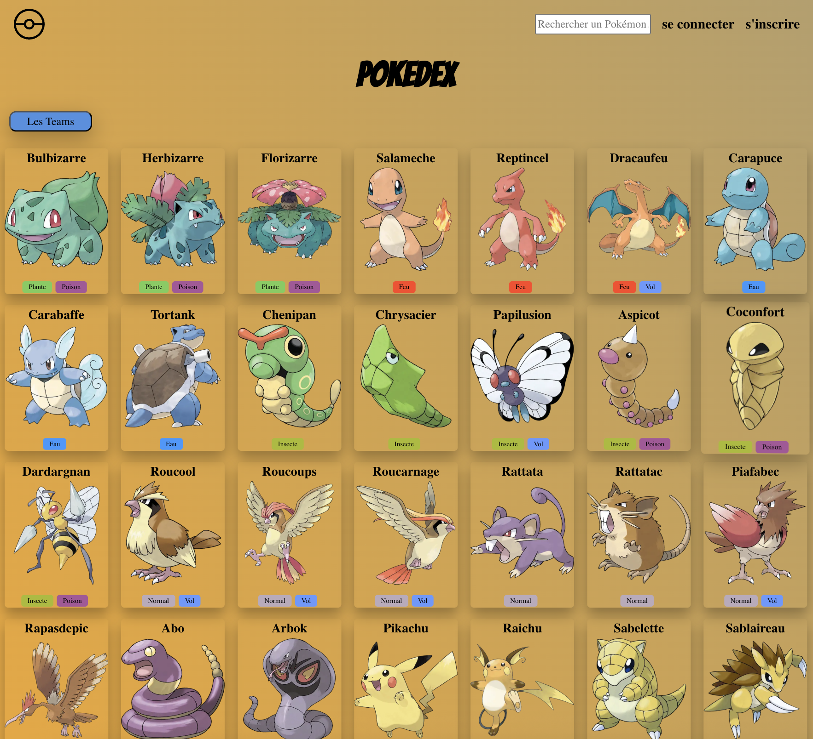
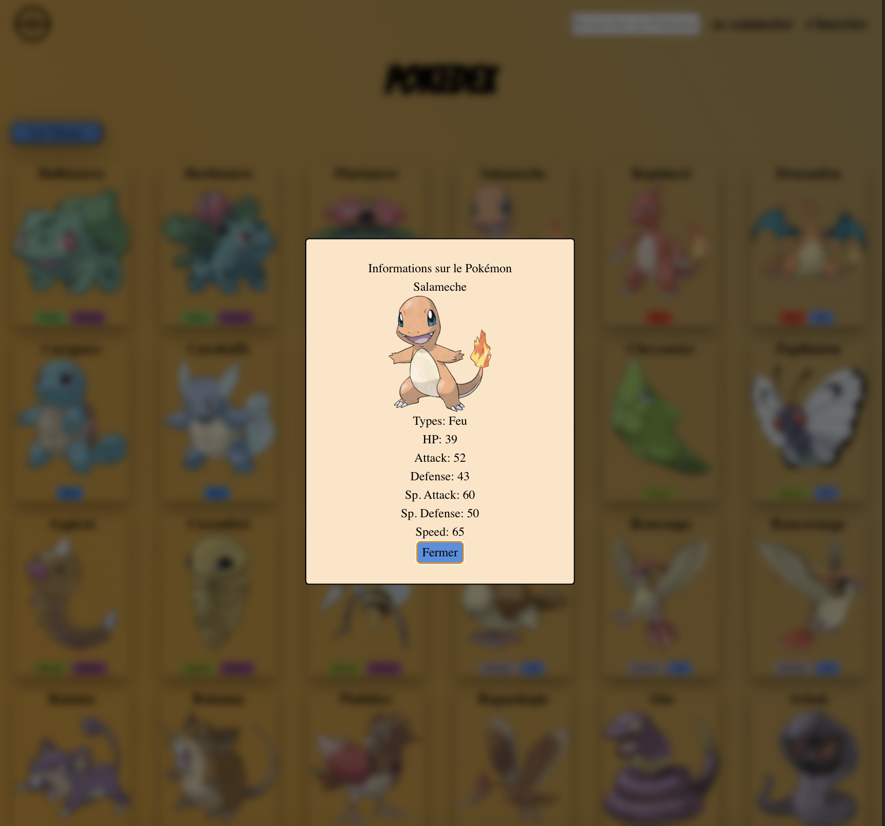

# 🧩 Pokédex - Projet de formation

Ce projet a été réalisé dans le cadre de ma formation à l’école O’clock.  
L’objectif principal était de manipuler des données dynamiques issues d’une API et de les afficher dans le DOM, avec une interface interactive incluant une modale pour afficher les détails d’un Pokémon.

## 🛠️ Fonctionnalités

- 🔄 Récupération des Pokémons depuis une API
- 🖼️ Affichage dynamique dans le DOM
- 🔍 Filtre en temps réel via un champ de recherche
- 💬 Affichage des détails d’un Pokémon dans une modale (nom, image, types, statistiques)
- 🎨 Mise en forme avec styles CSS

## 🧪 Technologies utilisées

- HTML5 / CSS3
- JavaScript (ES6+)
- API Fetch
- `<dialog>` pour les modales
- `<template>` pour les éléments dynamiques
- Vite pour le serveur de développement

## 🖼️ Aperçu visuel

### Accueil - Liste des Pokémon

### Détails d’un Pokémon (modale)

